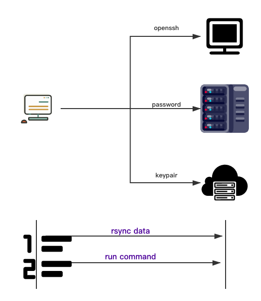

<!-- START doctoc generated TOC please keep comment here to allow auto update -->
<!-- DON'T EDIT THIS SECTION, INSTEAD RE-RUN doctoc TO UPDATE -->
**Table of Contents**

- [Call: Make remote development more elegant](#call-make-remote-development-more-elegant)
  - [What does it do](#what-does-it-do)
  - [How it works(now)](#how-it-worksnow)
    - [Architecture](#architecture)
  - [Quick Start](#quick-start)
    - [Step 1: install call command tools](#step-1-install-call-command-tools)
    - [Step 2: init call](#step-2-init-call)
    - [Step 3: run call](#step-3-run-call)
  - [Requirements](#requirements)
  - [TODO](#todo)
  - [Contributing](#contributing)

<!-- END doctoc generated TOC please keep comment here to allow auto update -->

<p align="center">
  
</p>

# Call: Make remote development more elegant

[](https://www.apache.org/licenses/LICENSE-2.0.html)

[](https://travis-ci.com/bingryan/call)

-------

## What does it do

`Call` is an easy-to-use command tools for remote development. It helps you to build remote development easily and
elegant. It can work with [makefile](https://github.com/mirror/make) and [justfile](https://github.com/casey/just).

`Call` provides three ways.

* **openssh**
  SSH Login Without Password

* **password**
  SSH Login With Password

* **keypair**
  SSH Login With Private Key File

## How it works(now)

Functions currently implemented:

* step1: synchronize data to the specified server

* step2: execute commands on the remote server

### Architecture

<p align="center">
  
</p>


## Quick Start

It is super easy to get started with your first project.

### Step 1: install call command tools

```shell
cargo install --git  https://github.com/bingryan/call.git
```

or

```shell
cargo install rust-call
```

### Step 2: init call

```shell
cd your_project_homepage
call i
```

there will be a `call.yml` file at `your_project_homepage`. Then you can configure `call.yml`。such as:

```yaml
call:
  config:
    active:
      openssh:
        - dev  # active server label
    runner: make  # make -> makefile , just -> justfile
  mapping:
    src: . # current dir
    dest: ~/workspace/call  # remote path
    exclude: # Ignored directories in .gitignore will also be ignored
      - ./target
      - README.md
  server:
    openssh:
      dev: # label for openssh server
        host:
          - 192.168.2.49 # multiple
        port: 22
        authentication_type: openssh
        username: rust # remote server username


```

### Step 3: run call

replace `make xxx` with `call xxx` command, when your project has makefile.

replace `just xxx` with `call xxx` command, when your project has justfile.

## Requirements

- **openssh** (rsync)
- **password** (rsync,sshpass)
- **keypair** (rsync)

```shell
# Debian/Ubuntu
$ sudo apt-get install rsync
$ sudo apt-get install sshpass

# Red Hat
$ sudo yum install rsync
$ sudo yum install sshpass

# Arch Linux
$ sudo pacman -S rsync
$ sudo pacman -S sshpass

# MacOS
$ brew install rsync
$ brew install http://git.io/sshpass.rb(if notwork, copy raw content to `sshpass.rb`: brew install sshpass.rb)
```


## TODO

* [ ]  ~~Call Server(Relay Server):  relay server which is able to coordinate with clients to establish connectivity(use other port forward tools).~~
* [x]  default template(Put the template.yml under ~/.call/template.yml and copy it directly when run: call i)

## Contributing

Contributors are welcomed to join this project. Please check [CONTRIBUTING](./CONTRIBUTING.md) about how to contribute
to this project.
